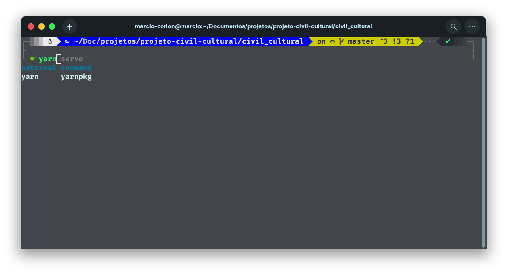
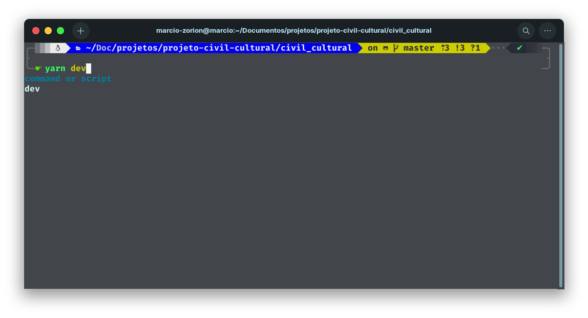

# Civil Cultural

Essa documentação é um guia para rodar a aplicação no ambiente local. E também há algumas referências das bibliotecas usada.

### Instalando dependências
> Usamos o yarn para gerenciar os pacotes nesse projeto.

    

### Executando a aplicação no modo desenvolvimento

    

Obs: Use boas práticas nesse projeto. Use as cores padrões definida no arquivo `src/styles/global.scss` crie variáveis ou mixin do sass no arquivo `src/styles/_utils.scss` leia mais sobre nesse [link](https://tecmedia.com.br/semantica-performance-e-boas-praticas-no-codigo-front-end/).

### Bibliotecas usadas
[Vitejs + React + SWC + Typescript](https://vitejs.dev/guide/)

[React](https://react.dev)

[React Router Dom](https://reactrouter.com/en/main/start/overview)

[Sass](https://sass-lang.com/)

[Node Sass](https://www.npmjs.com/package/node-sass)

[Bootstrap v5](https://getbootstrap.com/)

[React Bootstrap](https://react-bootstrap.github.io/)

[next-18-next](https://github.com/isaachinman/next-i18next#readme)

[React Hook Form](https://www.react-hook-form.com/)
[Yup](https://www.npmjs.com/package/yup)

[React Icons](https://react-icons.github.io/react-icons/)

[React Use](https://github.com/streamich/react-use#readme)

[React Is](https://www.npmjs.com/package/react-is)

[Rive React](https://github.com/rive-app/rive-react#readme)
